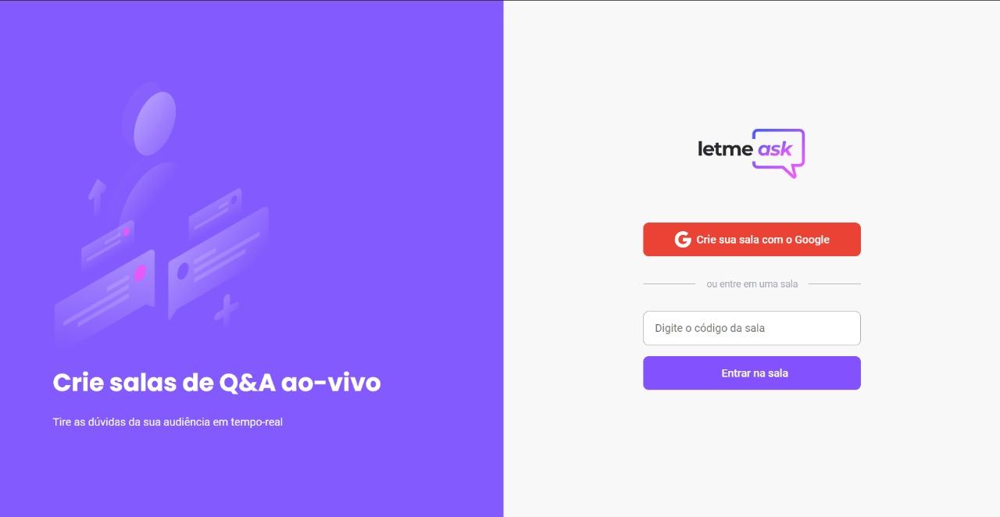
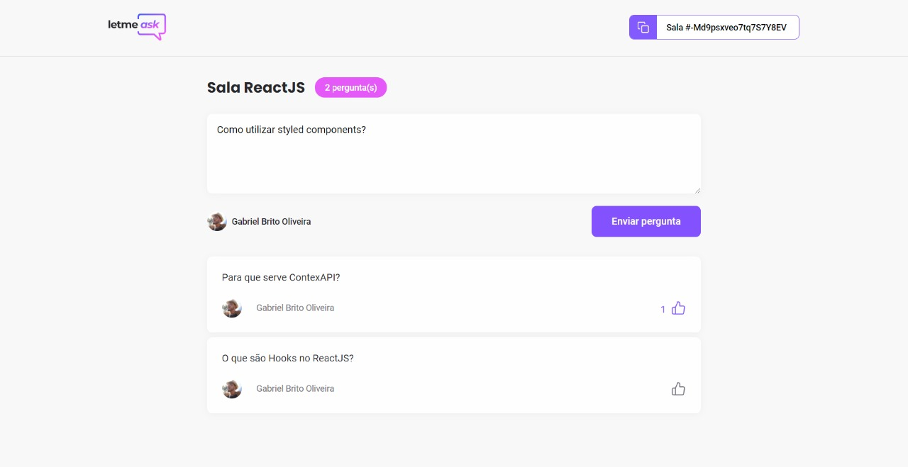
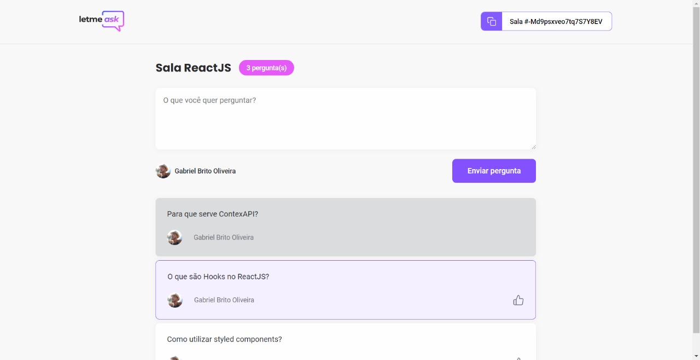
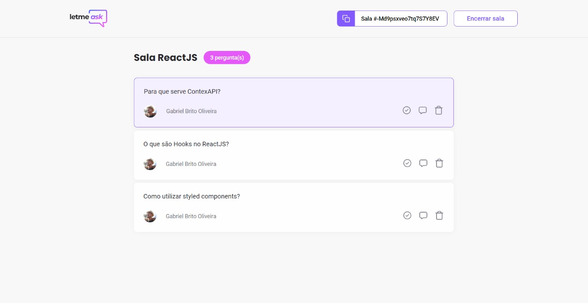
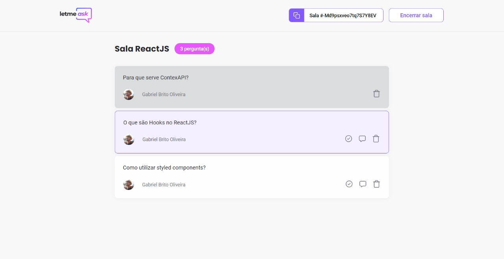

<h1 align="center">Letmeask</h1>

# 💻 Sobre o projeto

letmeask é um aplicativo que lida com perguntas realizadas em lives voltadas para ambito educativo. Através dele o palestrante/professor pode criar uma sala e convidar a todos seus espectadores a participar dela. Enquanto os participantes da live interagem com o App, curtindo e realizando perguntas, o professor se encarrega de marcar aquelas que estão sendo ou já foram respondidas

<h3 align="center"> 
	🚧 🚀 Status de Andamento do Projeto: Finalizado.  🚧
</h3>

## Funcionalidades...

### para administradores e espectadores:
- [x] Login com Google
- [x] Entrar em sala existente
### para administradores:
- [x] Sala para gerenciamento de perguntas de usuários (Interface)
- [x] Marcação para perguntas que estão sendo respondidas em tempo real
- [x] Marcação de perguntas já respondidas
- [x] Exclusão de perguntas
- [x] Encerramento da sala
### para espectadores:
- [x] Sala para perguntas (Interface)
- [x] Criação de perguntas
- [x] Curtidas

# 🛠 Tecnologias

Para a construção do projeto, as seguintes Tecnologias foram utilizadas:

- [HTML](https://developer.mozilla.org/pt-BR/docs/Web/HTML)
- [CSS3](https://developer.mozilla.org/pt-BR/docs/Web/CSS)
- [Typescript](https://www.typescriptlang.org/docs/)
- [ReactJS](https://pt-br.reactjs.org/docs/getting-started.html)
- [SASS](https://sass-lang.com/documentation)

# 🎨 Layout

## Home

 
    

## Página para espectadores

 
    
    

## Página para administradores

    
    

# Autor
Feito por Gabriel Brito ❤️👋🏽
 
